# Wallet Module - Sequence Diagrams

Tài liệu này mô tả sequence diagram cho từng use case trong Wallet Module.

---

## 1. Get Wallet Summary

**Use Case**: User xem tổng quan số dư Diamond, VEX và trạng thái Monthly Card

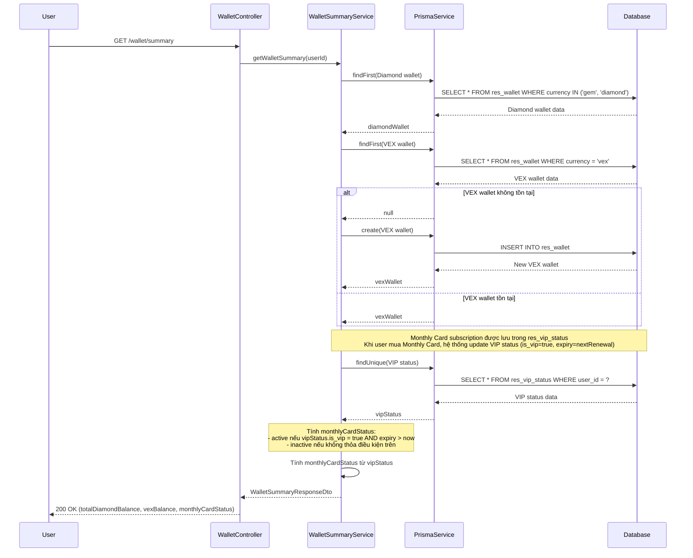

---

## 2. Get Recharge Packages

**Use Case**: User xem danh sách các gói nạp Diamond

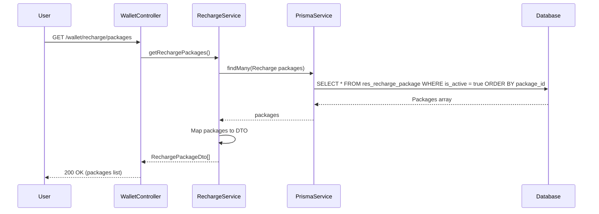

---

## 3. Get Monthly Cards

**Use Case**: User xem danh sách các Monthly Card subscription

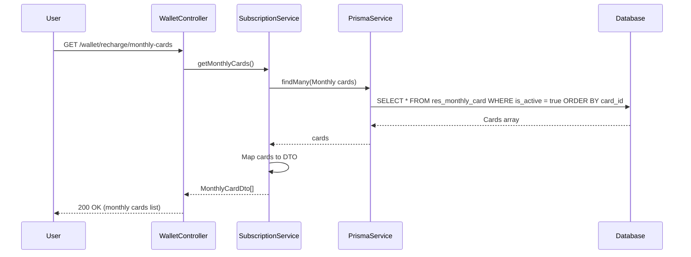

---

## 4. Checkout Recharge (Purchase Diamond Package)

**Use Case**: User mua gói nạp Diamond

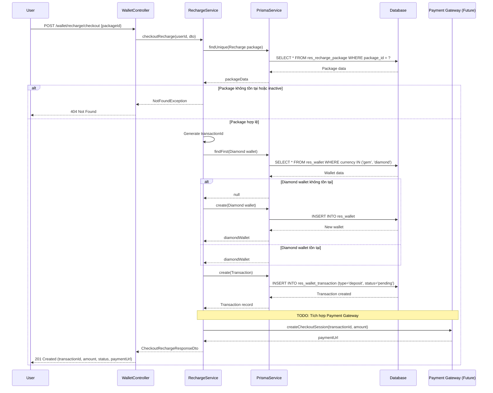

---

## 5. Purchase Subscription (Monthly Card)

**Use Case**: User đăng ký Monthly Card subscription

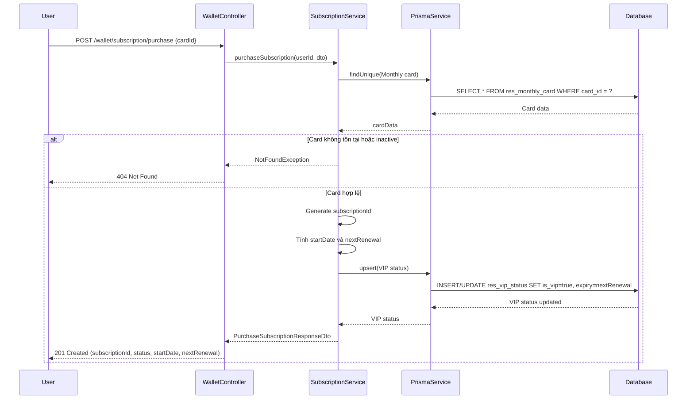

---

## 6. Get Subscription Details

**Use Case**: User xem chi tiết subscription Monthly Card

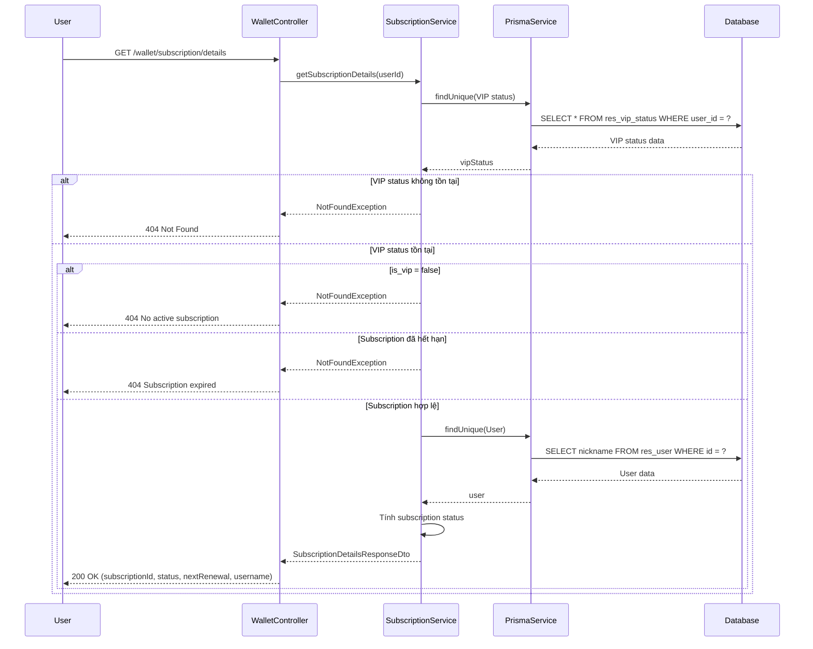

---

## 7. Get Transaction History

**Use Case**: User xem lịch sử giao dịch

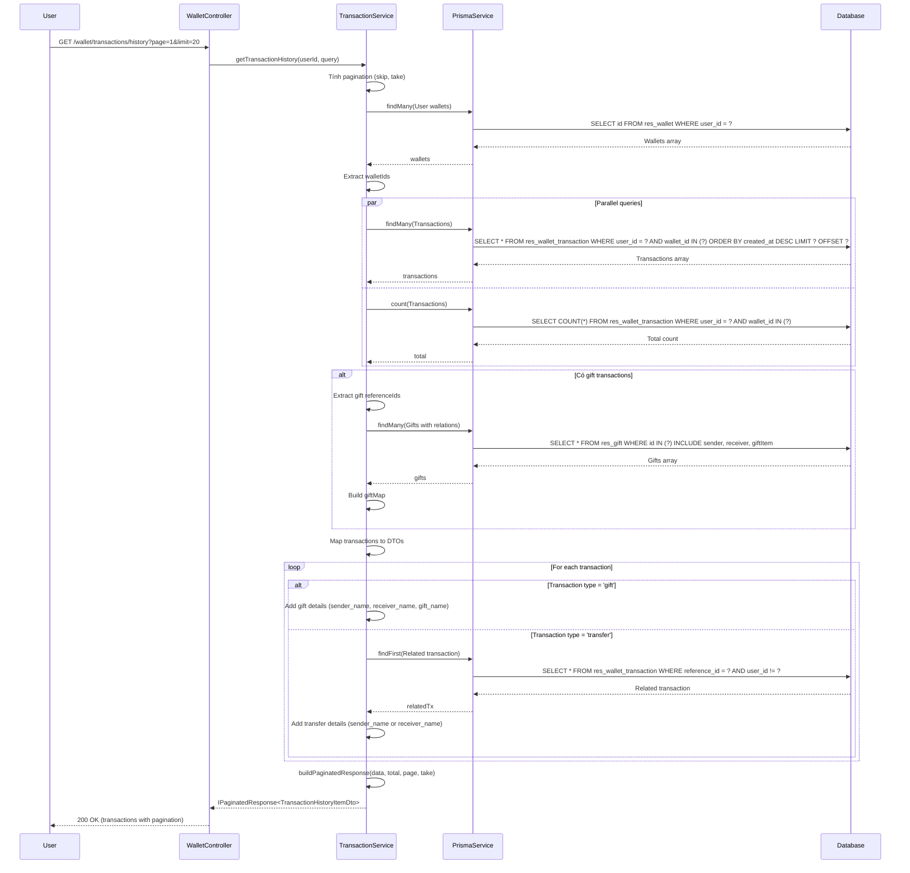

---

## 8. Convert VEX to Diamond

**Use Case**: User chuyển đổi VEX sang Diamond (có bonus)

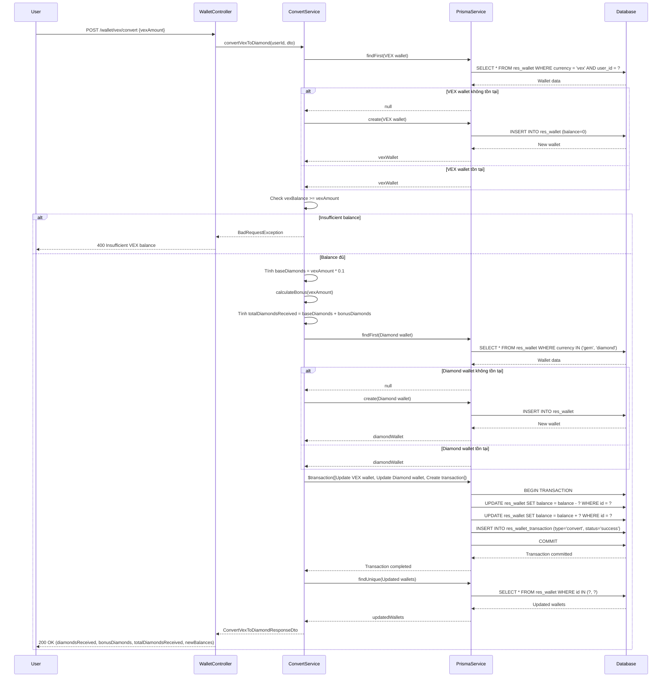

---

## 9. Create Deposit Address

**Use Case**: User tạo địa chỉ deposit để nhận VEX

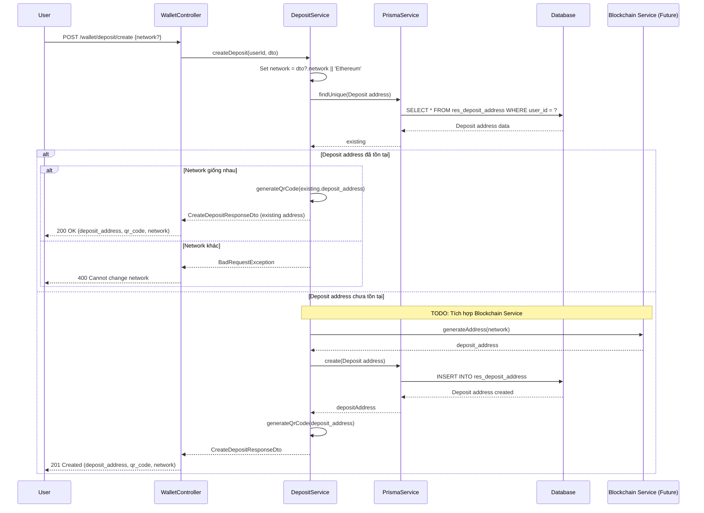

---

## 10. Get Deposit Info

**Use Case**: User xem thông tin địa chỉ deposit hiện tại

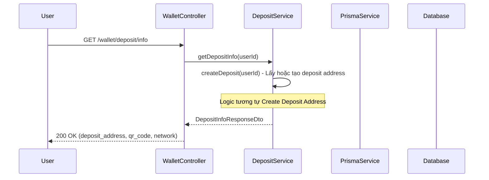

---

## 11. Withdraw VEX

**Use Case**: User rút VEX từ wallet

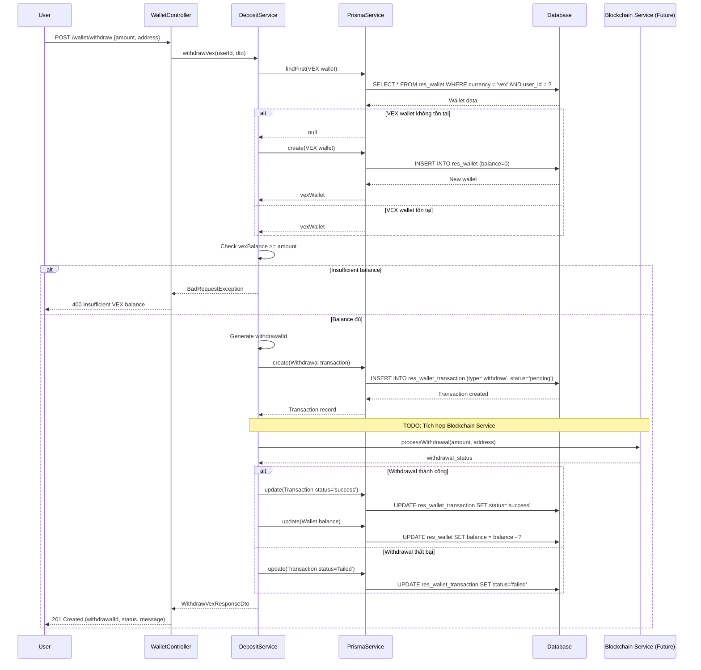

---

## 12. Transfer VEX

**Use Case**: User chuyển VEX cho user khác

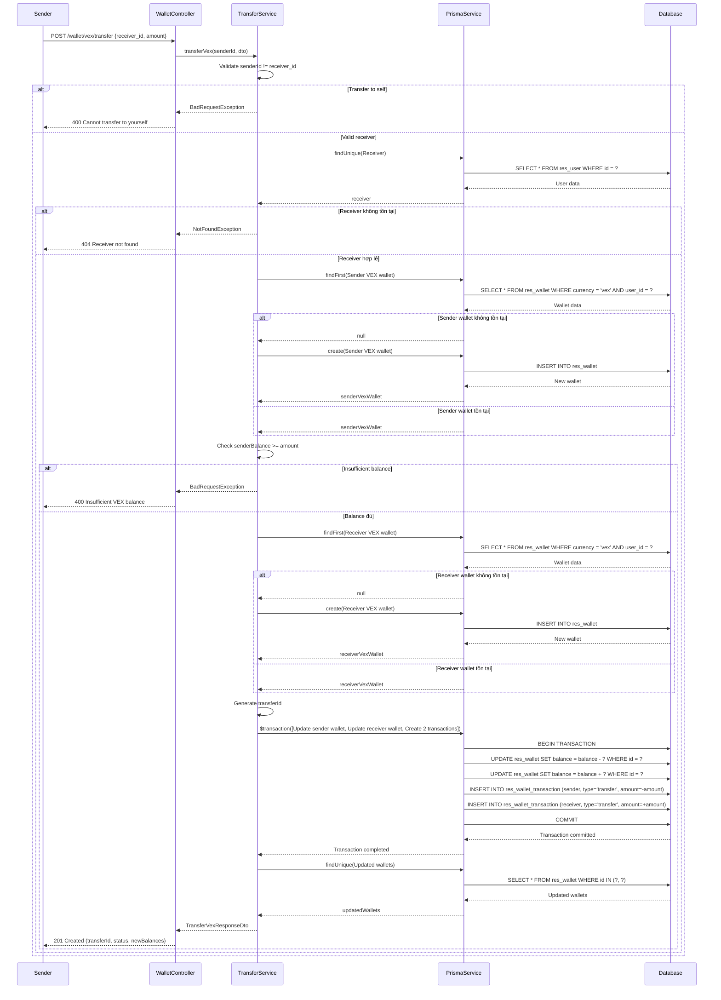

---

## 13. Update Deposit Network

**Use Case**: User cập nhật network cho deposit address

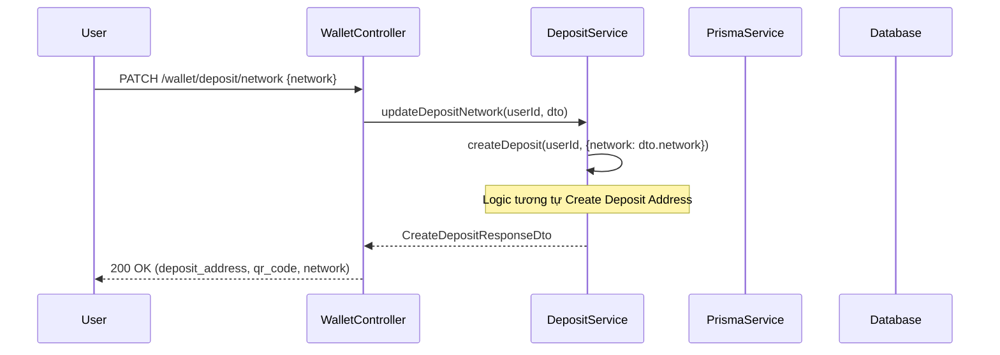

---

## 14. Verify IAP Receipt

**Use Case**: User xác minh giao dịch In-App Purchase (iOS/Android)

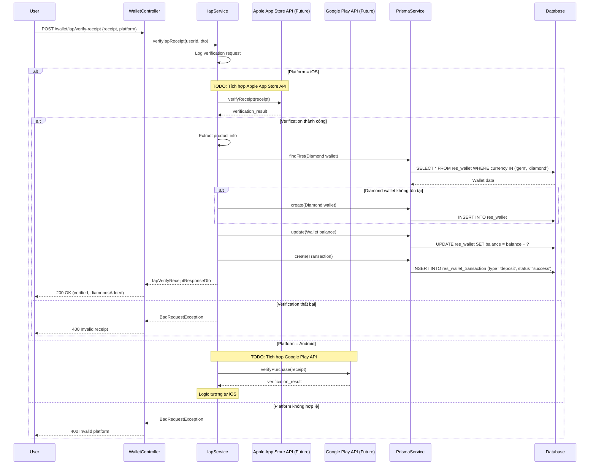

---

## 15. Get Payment Methods

**Use Case**: User xem danh sách phương thức thanh toán

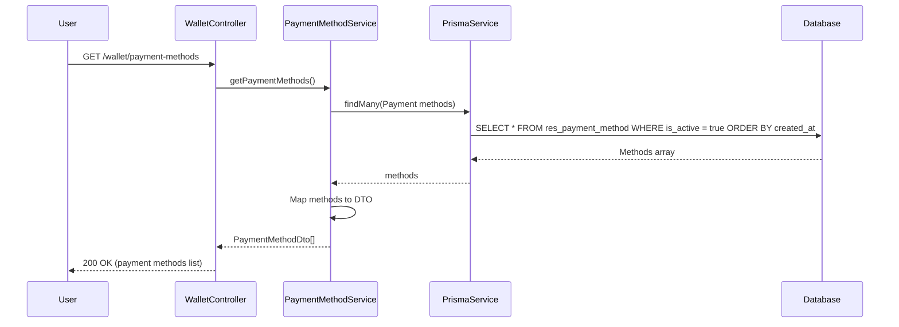

---

## Notes

### Authentication

- Tất cả các endpoints đều yêu cầu authentication thông qua `AuthGuard('account-auth')`
- User chỉ có thể truy cập wallet của chính mình

### Error Handling

- Các lỗi validation được xử lý bởi `ValidationPipe`
- Business logic errors được throw dưới dạng `BadRequestException`, `NotFoundException`
- Database errors được handle bởi Prisma

### Future Integrations

- **Payment Gateway**: Cần tích hợp với Stripe, PayPal, VNPay cho checkout recharge
- **Blockchain Service**: Cần tích hợp để generate deposit addresses và process withdrawals
- **IAP Services**: Cần tích hợp với Apple App Store và Google Play Store APIs

### Transaction Safety

- Các operations quan trọng (convert, transfer) sử dụng database transactions để đảm bảo data consistency
- Wallet balance updates được thực hiện atomic trong transactions
